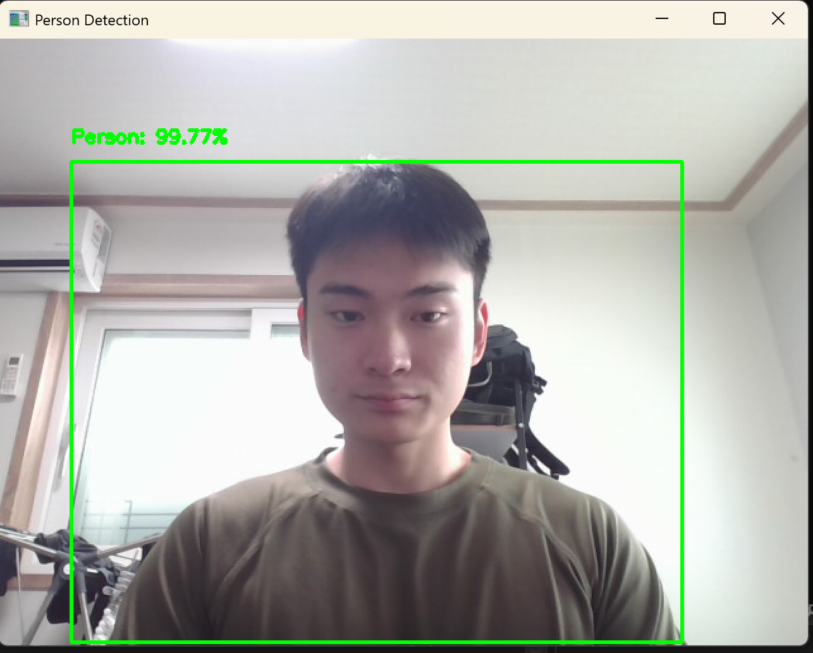
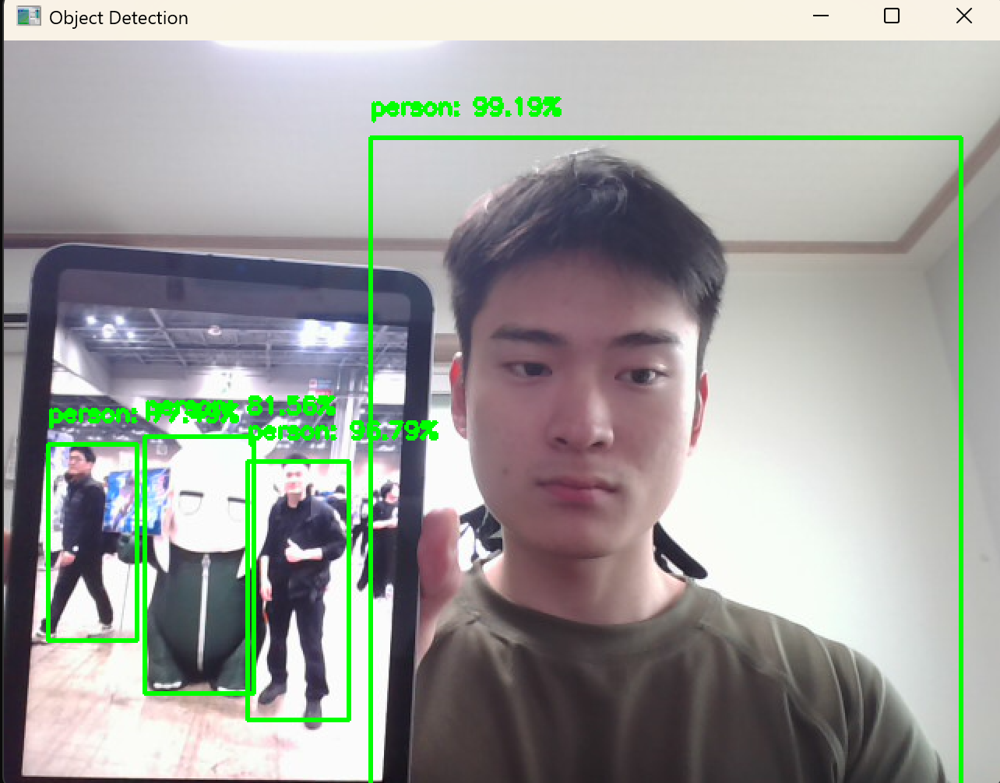

# 실시간 객체 인식 (MobileNetSSD + OpenCV)

## 📌 프로젝트 개요

웹캠 영상을 실시간으로 처리하여 사람, 고양이, 개, 자동차 등 다양한 객체를 인식하고, 화면에 바운딩 박스와 신뢰도를 시각적으로 표시하는 Python 기반 객체 탐지 프로그램입니다.

---

## 🧠 사용 기술

- Python 3.x
- OpenCV 4.x (cv2.dnn 모듈)
- Pretrained MobileNet-SSD (VOC 데이터셋 기반, 20개 클래스)

---

## 🐾 인식 가능한 객체 예시

- **사람 (person)**
- **고양이(cat), 개(dog)**
- **자동차(car), 버스(bus), 기차(train)**
- **의자(chair), 테이블(diningtable), 화분(pottedplant)** 등

총 20종류의 객체를 인식합니다.

---

## 🚀 실행 방법

### 1. 필요한 패키지 설치

```bash
pip install opencv-python
```

### 2. 모델 파일 다운로드

- [`deploy.prototxt`](https://github.com/chuanqi305/MobileNet-SSD/raw/master/deploy.prototxt)
- [`mobilenet_iter_73000.caffemodel`](https://github.com/chuanqi305/MobileNet-SSD/releases/download/v1.0/mobilenet_iter_73000.caffemodel)

두 파일을 다음 위치에 저장:

```
C:\Project\Quokka\MobileNet-SSD-master\
```

### 3. Python 실행

```bash
python object_detection.py
```

**`q` 키를 누르면 종료됩니다.**

---

## 📷 실행 화면 예시

| 단일 인식 | 복수 객체 인식 (화면 속 인물 포함) |
|-----------|----------------------------------|
|  |  |

---

## 📂 프로젝트 구성

```
📁 Project Root/
├── object_detection.py      # 메인 코드
├── README.md
├── 23101189.png             # 실행 예시 1
├── 23101189_1.png           # 실행 예시 2
└── MobileNet-SSD-master/
    ├── deploy.prototxt
    └── mobilenet_iter_73000.caffemodel
```

---

## 📄 참고 자료

- MobileNet-SSD 모델 출처:  
  https://github.com/chuanqi305/MobileNet-SSD
- OpenCV DNN 모듈 문서:  
  https://docs.opencv.org/master/d6/d0f/group__dnn.html

---

## 👤 개발자

- 신대혁
